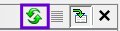
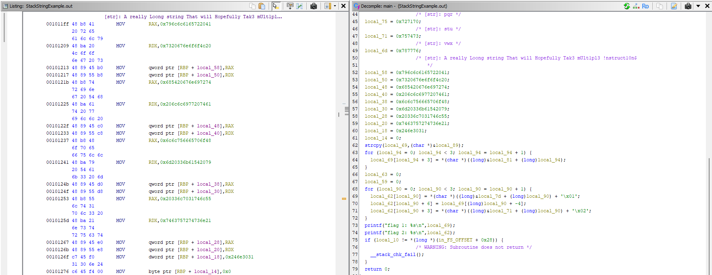
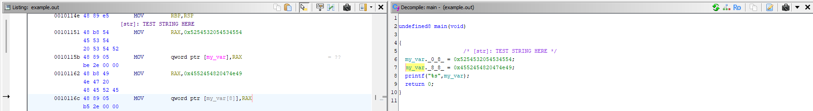

  

# Stack String Explorer
Stack String Explorer is a ghidra plugin to find and report stack strings (and other constant strings)

- Adds identified strings in the defined strings window for easy search and filtering
- Inserts comments above stack strings in listing & decompilation views
- Reconstructs strings formed by multiple instructions
- Analysis scope options (single function, selection, full binary)
- Headless analyser support
- Find repeated use of similar strings across the code base

Through optimizations or deliberate obfuscation, sometimes strings are stored as immediates in instruction operands rather than helpful heap locations. Tools like ghidra display these as hex constants and make no effort to reconstruct or decode them. Stack String Explorer searches a binary for any such constant strings and displays them such that they can be grouped and filtered.

## ⬇️ Installation
- Install Ghidra https://github.com/NationalSecurityAgency/ghidra/
- Clone this repo
- Add the `ghidra_scripts` directory as an addition Ghdira scripts directory. To do this:
  * Open `Window -> Script Manager`  and click `Manage Script Directories` 
  * Click the plus button and add the path to this repo's `ghidra_scripts` directory.

## ▶️ Usage
#### GUI:
- Open a binary in ghidra and navigate to `Window -> Script Manager` 
- Search for `StackStringExplorer.py` and double click the name to run
- Refresh the Defined Strings window  or check the console to see new strings

#### Headless:
- Set up `StackStringExplorer.properties` (see below)
- Run the command: `$ analyzeHeadless <PROJECT_PATH> <PROJECT_NAME> -import <TARGET_FILENAME> -postScript StackStringExplorer.py`

## ⚙️ Settings
#### GUI:
Click through the popups on program start. A default configuration is provided. Below is a full explanation of each setting should you need to diverge from the defaults.

#### Headless:
Download the `StackStringExplorer.properties` file and place in the same location as `StackStringExplorer.py`. Write your configuration choice after the `=` on each line. Lines that start with `#` or `!` are ignored. Domain selection is not available in headless mode, it will always run on all functions.

---
### 👟 Domain
Which part of the program to analyze

| Option            | Description                                                                   |
|-------------------|-------------------------------------------------------------------------------|
| Current Selection | Run on all discovered instructions in the selected region                     |
| Current Function  | Run on all discovered instructions in the function the cursor is currently in |
| All Functions     | Run on all discovered functions                                               |

---
### 🔧 General Settings
| Settings                   | Description                                                                                                                                                                                                                                                                                    |
|----------------------------|------------------------------------------------------------------------------------------------------------------------------------------------------------------------------------------------------------------------------------------------------------------------------------------------|
| Minimum String Length      | The shortest length of string to identify. Use to reduce false positives.                                                                                                                                                                                                                      |
| Lookahead                  | The number of instructions to search after an instruction containing a string for more components of the same string. If the lookahead is too small, strings may be reported as multiple sub strings. If the lookahead is too large, unrelated string components may be concatenated together. |
| Minimum Length of Interest | The minimum number of characters moved in a single instruction for it to be considered of interest e.g. if a string is moved in 3 byte blocks it will be discarded with a length of interest greater than 3.                                                                                   |
| Reverse                    | Whether to reverse the order in which string components are concatenated.                                                                                                                                                                                                                      |

---
### 📊 Analysis
Which analysis techniques to run

| Option            | Description                                                                                                                 |
|-------------------|-----------------------------------------------------------------------------------------------------------------------------|
| Simple Scrape     | Grabs all scalar arguments to instructions in the order they are used, concatenating nearby constants.                       |
| Simulate Regional | Simulates regions of instructions around instructions of interest independently, then extracts strings from modified memory. |
| Simulate All      | Simulates all the instructions in the domain then extracts strings from modified memory.                                     |

---
### 📮 Address Filtering
How strictly to filter out strings which might be addresses

| Option | Description                                                                                                                                  |
|--------|----------------------------------------------------------------------------------------------------------------------------------------------|
| None   | Don't filter out any strings based on how much they resemble an address.                                                                      |
| Some   | Filter out constants that are within 255 bytes of the address of the originating instruction. This generally removes return addresses.        |
| All    | Filter out any constants marked as addresses by their OperandType. If an operand has been incorrectly flagged, this may remove valid strings. |

---
### 📝 Output
How to display the results

| Option                 | Description                                                                                                                                                                                                                        |
|------------------------|------------------------------------------------------------------------------------------------------------------------------------------------------------------------------------------------------------------------------------|
| Print to console       | Stack strings will be printed to the console with their length and the location of the originating instruction.                                                                                                                    |
| Add pre-comment        | Adds a comment above each originating instruction with the extracted string. If the string spans multiple instructions only the first will be commented.                                                                           |
| Add to defined strings | Adds strings to the defined strings window. This is implemented by adding strings to a memory overlay block and adding cross reference to the originating instruction. **This requires an exclusive checkout for shared projects** |

The Defined Strings window must be refreshed  for the stack strings to appear.

Strings that have already been added to defined strings by a previous run of this program will not be reported again in the console and will not be added to defined strings twice. The comment will be replaced regardless of previous script executions.

## 📐 Support and Limitations
Stack String Explorer operates on Pcode and can support any architecture Ghidra supports. It relies on Ghidra's identification of functions and instructions.

#### Simple Scrape
Finds any constants used in any form so will find every string regardless of how it is built.
If the string is accessed out of order, it may reorder parts of a string or concatenate unrelated strings.

#### Simulate Regional
Simulates where each string is stored in memory so it is able to order string components correctly and separate strings stored in different locations. It supports strings formed using move or store-like instructions, as well as inferring strings from compare-like instructions.

Simulate Regional is the best option for the majority of applications, however it may miss some context before an instruction of interest and fail to notice strings components are related

#### Simulate All
Operates in the same manner as Simulate Regional and is able to identify the correct component order.
When run on large section, e.g. All Functions or Current Function, it can encounter ambiguity if multiple strings are stored in the same location during the simulated range. This leads to components being reported individually and concatenation of unrelated components.

Simulate All is best used in specific areas to manually increase the range of the simulation where Simulate Regional has missed some context, particularly if there is relevant context in the instructions preceding the instruction containing the scalar string.

### General Limitations
- If the same string is found in multiple places it will be added only once to the defined strings window with multiple cross references to the different locations. However, if the same string is found in a new location on a separate run of the program, it will be added separately and not included in the same list of cross references.

## 🧶 Examples

Identifies strings moved over multiple instructions

Identifies strings moved to locations other than the stack

## 📁 File structure
- `ghidra_scripts`
  - `StackStringExplorer.py` - contains the main loader for this script. It gets the parameters, sets up analysis techniques, and runs the analysis. It relies heavily on the scripts in `stackstring_helper_scripts`

- `stackstring_helper_scripts`
  - `technique.py` - contains an abstract class describing a generic analysis technique
  - `regional_technique` - contains an abstract class describing an analysis technique that runs only - instructions around ones likely to contain a string
  - `simulator.py`, `scraper.py`, `region_simulator` - contain classes for each of the analysis   - techniques
  - `abstract_address.py`, `stack_string.py` - contain classes used by the simulator to represent   - values stored in memory
  - `parameters.py` - contains a class for describing the input configuration of the program
  - `general_utilities`, `specific_utilities`, `io_utilities` - contain functions used across other files
  - `stack_strings_enums` - contains enums used across other files